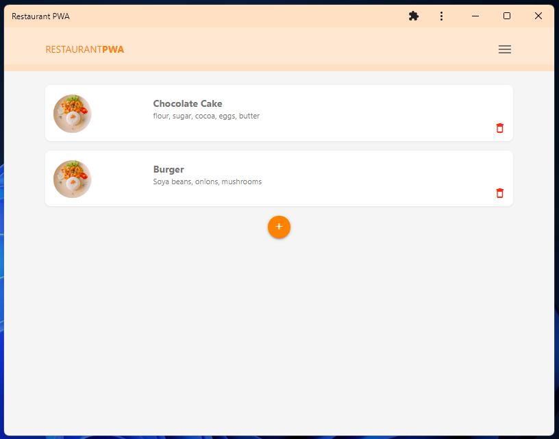
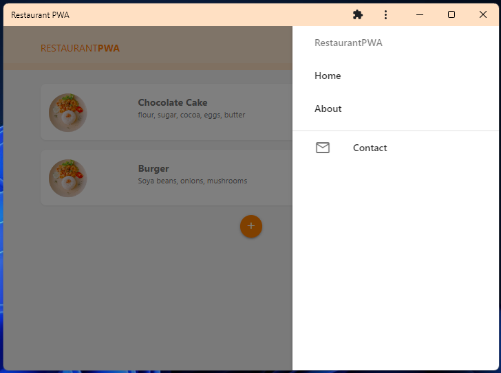
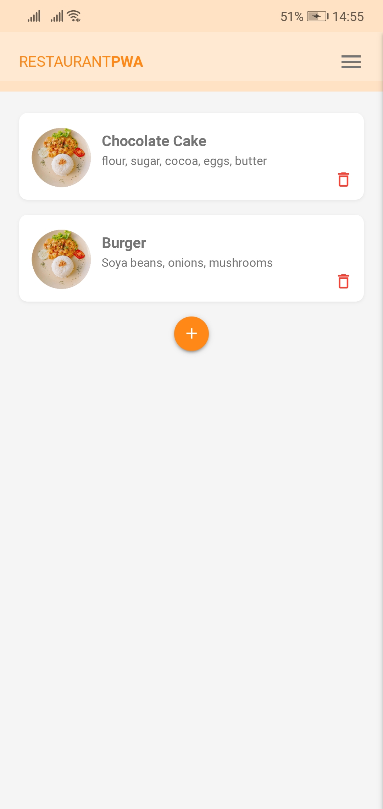
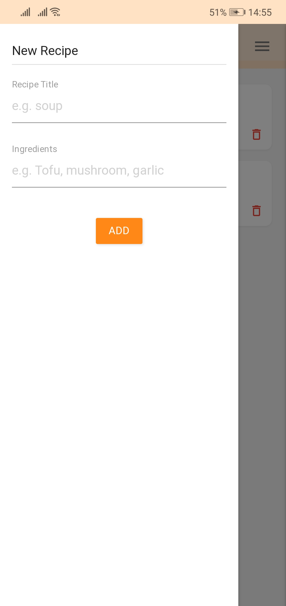
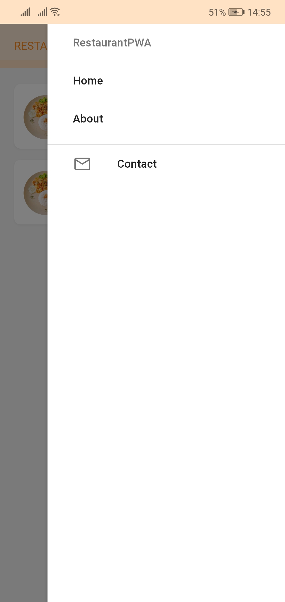

# Restaurant Recipes PWA

## Overview

This is a simple Progressive Web App (PWA) designed for managing recipes used by a restaurant. The app allows users to perform CRUD (Create, Read, Update, Delete) operations on recipes. It is built using HTML, CSS, and JavaScript, and the backend is powered by Firebase Firestore. Materialize CSS and icons are used for styling.

## Features

- **CRUD Operations:** Perform Create, Read, Update, and Delete operations on recipes.
- **Firebase Integration:** Utilizes Firebase Firestore for seamless backend operations.
- **Material Design:** Styled with Materialize CSS for a clean and modern UI.

## Screenshots







## Getting Started

### Prerequisites

- Ensure you have Node.js and npm installed on your machine.

### Installation

1. Clone the repository:

```terminal
git clone https://github.com/SaeedBashar/Restaurant-PWA.git

2. Install 'live Server' extension on VSCode or your favorite editor

3. You are good to go

## About Progressive Web Apps (PWAs)
### Progressive Web Apps offer the following advantages:

**Offline Access**: PWAs can work offline or with a poor internet connection, providing a seamless user experience.
**Responsive Design**: They adapt to various screen sizes and device capabilities.
**App-Like Experience**: PWAs feel like native mobile apps, providing a smooth and immersive experience.
**Installation-Free**: Users can access the app without going through an app store installation process.

### Contributing
Contributions are welcome! Feel free to open an issue or submit a pull request.